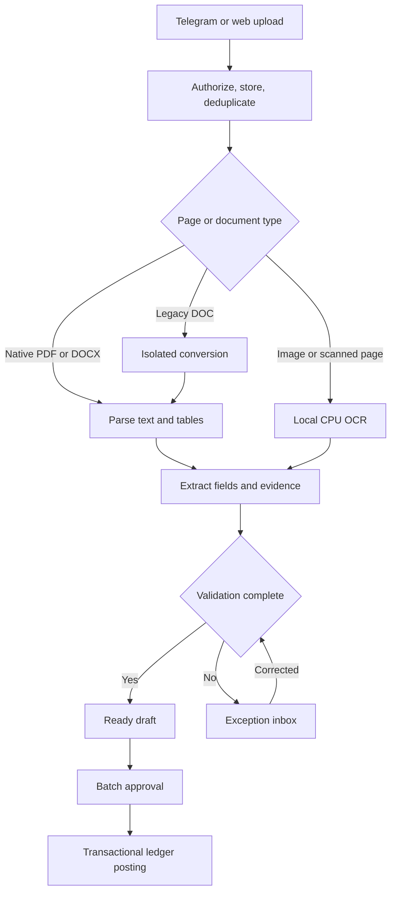

# CPU invoice extraction: decision and research

Checked 5 September 2026. Recommendations are design choices, not measured Mizano results.

## Decision

Use **native parsing → local Arabic/English OCR where needed → deterministic field extraction → Decimal validation → automatic draft preparation → one batch accountant approval**. LLMs, GPUs and cloud AI are not required for the ten-day demo. OCR itself is machine learning, but a large generative model is not necessary for every document.

Use Tesseract `ara+eng` as the simplest baseline and compare the explicit Paddle Arabic mobile recognizer on the target CPU. Choose using invoice field accuracy and review time, not generic OCR benchmark rankings. Start with a declared supported set of invoice layouts; unfamiliar or unreadable documents go to an actionable exception state. No engine can reliably recover information absent from a blurred image.

## Options and tradeoffs

| Option | Verified facts | Decision |
| --- | --- | --- |
| Native PDF/DOCX parsing | Extract available text/tables directly; OCR adds unnecessary inference for already readable text | First route. Keep page/paragraph/table provenance; mixed PDFs require per-page decisions. |
| Tesseract | Apache-2.0; Arabic `ara` and English data available. Quality guidance covers resolution, deskew and noise cleanup | Default CPU baseline; preserve bounding boxes and originals. It reads text, not a finished accounting object. [Language data](https://tesseract-ocr.github.io/tessdoc/Data-Files-in-different-versions.html), [quality guide](https://tesseract-ocr.github.io/tessdoc/ImproveQuality.html), [installation/license](https://tesseract-ocr.github.io/tessdoc/Installation.html). |
| Paddle Arabic mobile OCR | Official `arabic_PP-OCRv5_mobile_rec`, Apache-2.0; model must be chosen explicitly. Recognition model size is not total process RAM | CPU challenger. Pin version/hash, include detector/recognizer resources, measure actual architecture. No silent Chinese/English fallback. [Official model card](https://huggingface.co/PaddlePaddle/arabic_PP-OCRv5_mobile_rec). |
| PaddleOCR-VL-1.5 | Apache-2.0; paper lists 111 languages including Arabic. CPU instructions exist for x64; quick-start production suitability requires evaluation | Later research, off demo critical path. No inference that GPU benchmark speed applies to CPU or ARM. [Model](https://huggingface.co/PaddlePaddle/PaddleOCR-VL-1.5), [paper](https://arxiv.org/html/2601.21957v2), [hardware guidance](https://www.paddleocr.ai/main/en/version3.x/pipeline_usage/PaddleOCR-VL.html). |
| Docling/LibreOffice | Docling supports PDF/DOCX; legacy DOC conversion requires LibreOffice. Docling code MIT, models have individual licenses | Evaluate parser components only as needed; isolate legacy conversion with macros/network disabled and resource limits. No blanket Arabic accuracy claim. [Formats](https://docling-project.github.io/docling/usage/supported_formats/), [license](https://github.com/docling-project/docling). |
| Gemini paid API | 2.5 Flash-Lite listed at $0.10/M input + $0.40/M output tokens. Unpaid-service terms prohibit confidential/personal submissions and permit improvement/review use | Optional later tenant-approved fallback only. No real invoices in unpaid tier. No cloud dependency in demo. [Pricing](https://ai.google.dev/gemini-api/docs/pricing), [terms](https://ai.google.dev/gemini-api/terms). |
| Azure prebuilt invoice | Arabic explicitly supported; F0 500 pages/month, first two pages/request, 4MB/file and 1 analysis TPS | Comparison candidate after demo; limited free tier is not free unlimited operation. Region and data terms matter. [Languages](https://learn.microsoft.com/en-us/azure/ai-services/document-intelligence/language-support/prebuilt?view=doc-intel-4.0.0), [limits](https://learn.microsoft.com/en-us/azure/ai-services/document-intelligence/service-limits?view=doc-intel-4.0.0), [pricing](https://azure.microsoft.com/en-us/pricing/details/document-intelligence/). |
| Google Document AI | Arabic is available for OCR but absent from the published Invoice Parser language list; parser bills $0.10 per 1–10-page document block | Do not select prebuilt Invoice Parser as a verified Arabic solution. OCR and invoice extraction are different SKUs. [Processor matrix](https://docs.cloud.google.com/document-ai/docs/processors-list#processor_invoice-processor), [pricing examples](https://cloud.google.com/products/document-ai/pricing). |
| Colab-backed Ollama | Colab resources are not guaranteed; runtimes expire; managed service offerings outside interactive compute are restricted | Remove Colab from the operational demo dependency chain. [Official FAQ](https://research.google.com/colaboratory/faq.html). |

No-per-call-fee software still incurs CPU hosting, storage, backups and correction time. At a hypothetical 2,000 input/500 output tokens, Gemini 2.5 Flash-Lite would cost $0.0004 per request ($0.40/1,000), excluding document/image tokenization, retries, hosting and review. This is a formula illustration, not an observed invoice cost or recommendation to enable the API. Local hosting cost per invoice = allocated monthly infrastructure cost / processed invoice count, plus human correction cost. Measure before claiming savings.

## Pipeline contract

Persist document ID, tenant, source IDs, original hash, storage reference, MIME, page count, engine/version, schema version, field evidence, corrections, created draft ID and posting linkage. Normalize Arabic/Persian digits, decimal/group separators and bilingual labels while retaining raw text. Monetary API values are decimal strings. Separate tax rate, tax amount, discount amount and net/gross; do not infer currency from geography alone.

PDF: parse text page-by-page, OCR image-only pages, retain tables and reading order. DOCX: read text and tables without executing external links/macros. DOC: isolate conversion. Images: preserve original, evaluate rotation/deskew/crop/contrast, and request original upload when unreadable. Reject encrypted/corrupt/oversized files with a specific recovery path. Page/time caps must never silently truncate an invoice and mark it ready.

## CPU budget and benchmark

Assumption for initial planning: a CPU server with 4 vCPU/8GB RAM and SSD. This is not a verified server specification or purchasing recommendation. Day 1 records the actual architecture/resources and confirms packages work there. Start one OCR worker, bounded queue, per-document deadline, and explicit memory/CPU limits. Move heavy build/test jobs away from the serving process where possible. Benchmark x64/ARM separately if deployment architecture changes.

Use 60 labelled development documents and 30 held out by supplier/layout, Arabic/English/mixed, native/scanned/mixed PDF, DOCX/DOC and photos; at least 20 poor images across the corpus. Customer documents require permission/anonymization. Include non-100 line values, mixed tax rates, discounts, missing currency, duplicate invoices and page-two totals. No fixture leakage between tuning and holdout.

Measure critical-field exact match (vendor identifier, invoice number/date, currency, net/tax/gross), line-item precision/recall, review corrections/time, p50/p95 warm and cold latency, RAM, failures and CPU cost. Slice by language, format, quality and unseen layout. Targets: >=95% critical-header exact match on readable holdout and warm p95 <=30s for supported <=3-page invoices on recorded hardware. These are proposed targets; publish actual denominators and misses. Incorrect/missing amounts always require repair, irrespective of average accuracy. A demo that fails these targets is reported as limited or blocked, never relabelled as passing.

A tiny local text model may be researched later only if measured correction-time benefit fits the same CPU budget. Do not add it because a model name is fashionable.

## Telegram intake

Use a private configured channel, exact chat-ID-to-tenant mapping and least bot permissions. The hosted Bot API getFile path supports downloads up to 20MB; keep the demo application limit **15MB/file** (matching the current upload limit), report larger documents clearly, and offer authenticated web upload if a later web limit is larger. Prefer Send as File/Document originals; for photos choose the largest supplied variant.

Validate `X-Telegram-Bot-Api-Secret-Token` and chat allowlist before file access. Handle `channel_post`; edited posts become explicit document revisions, not duplicate bills. Persist/deduplicate `update_id` and tenant/chat/message/file identity; acknowledge only after durable acceptance, then fetch/OCR asynchronously with bounded retries. Token-bearing file URLs must never enter logs. Minimize status replies and do not echo invoice contents into a public channel. Bot setup/token/channel binding is a one-time operator setup, not repeated per invoice. [Telegram API](https://core.telegram.org/bots/api), [Bot FAQ](https://core.telegram.org/bots/faq).
