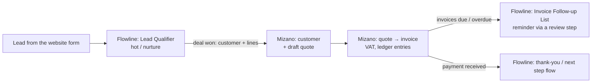

# Flowline × Mizano: integration story

Status: **vision, not built.** No Flowline connector for Mizano exists and Mizano has no outbound webhooks or API keys
today. This page lists the natural integration points found in both codebases (2026-10-09), so the product plan and
the two real-world videos tell the same story. The same page lives in both repos (`docs/video/integration-story.md`).

## One company, two products

Nour's office-supplies company in Cairo (sample data). **Flowline** handles the work that moves (leads, follow-ups,
orders); **Mizano** keeps the books (customers, quotes, invoices, payments, VAT, ledger).

## Integration points (what data passes)

| # | Trigger | From → to | Data | Flowline side today | Mizano side today |
|---|---|---|---|---|---|
| 1 | Lead qualified and the deal is won | Flowline → Mizano | customer `{name, company, email, phone, taxId?}`; quote lines `{item, qty, unitPrice, taxRate}`; currency | Lead Qualifier template (`src/engine/templates.ts`), HTTP node (`src/integrations/http.ts`) | `POST /api/customers`, `POST /api/quotes`, `POST /api/quotes/:id/convert-to-invoice`; CRM `POST /api/crm/deals/:id/won`, `POST /api/crm/leads/:id/convert` |
| 2 | Order confirmed | Flowline → Mizano | invoice lines `{sku, qty, price}`, customer id | Order Totals Digest (`templates.ts`), Order Packing List (`src/engine/local-scenarios.ts`) | `POST /api/invoices` |
| 3 | Invoice due or overdue | Mizano → Flowline | `{asOf, currency, invoices[{number, customer, amount, dueDate, paid}]}` | Invoice Follow-up List (`local-scenarios.ts`) takes exactly this shape; run via `POST /api/v1/flows/{id}/runs` (API key `runs:write`, `Idempotency-Key`) or a webhook trigger (`src/app/api/hooks/[token]`) | `GET /api/invoices`, `GET /api/reports/receivables-aging` (polling; no outbound events yet) |
| 4 | Payment received | Mizano → Flowline | `{invoiceNumber, customer, amount, currency, paidAt}` | any flow via webhook trigger | `GET /api/payments-received` (cursor polling) |
| 5 | Supplier bill captured | Mizano → Flowline | `{vendor, billNumber, total, dueDate}` for an approval flow | Agents with ASK permission (human decision) | bills, bill scan page (`/purchases/bills/scan`) |

## Rules both sides must keep

- Money travels as **decimal strings**, never JS numbers (Mizano AGENTS.md); Flowline's sample payloads use numbers
  today, so a connector must convert.
- No autonomous payments and no tax submission from a flow; an invoice or reminder that leaves the company needs a
  human approval step (Flowline ASK / review).
- Auth: Mizano needs a service account or scoped API keys (today: JWT login only). Flowline already has scoped API
  keys and signed, replay-safe webhooks.
- Arabic-first and RTL in both products; customer names stay as entered.

## Work this implies (for the product plan)

1. Mizano: scoped API keys and outbound webhooks (`invoice.overdue`, `payment.received`, `quote.accepted`).
2. Flowline: a Mizano provider (connection, "create customer", "create quote", "list overdue invoices" steps) and a
   "Deal won → Mizano quote" template.
3. A shared sample company for demos and both videos.

## How the videos use this

- Flowline film ends on point 1 as a labelled **vision** hand-off (cards only, no invented UI).
- Mizano film opens on the same company and customer and shows quote → invoice → payment → VAT on the real Mizano UI.
- The "better together" cut (30-45 s) walks points 1 → 3 with real UI on each side and labelled concept segments for
  the link itself.

Storyboards: Mizano [`storyboard.md`](storyboard.md) (this repo), Flowline `docs/video/storyboard.md` in AbdelrhmanAh7/FlowLine_Web.

Paths in the table: Mizano endpoints are under `apps/api/src/modules/` (global prefix `/api`); Flowline paths are in the FlowLine_Web repo.
