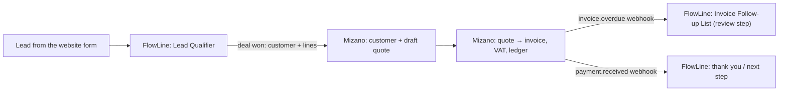

# Mizano — vision and goals

_Updated 2026-10-10 in the backlog restructure. Goals are GitHub milestones; each has a 'Goal demo' issue with manual test steps on the daily test link. Board: https://github.com/users/AbdelrhmanAh7/projects/20._

## Vision

Mizano is the Arabic-first accounting system for small businesses and their accountants in Egypt and the Gulf, light enough to run on a Raspberry Pi 5 in the office: a vendor bill photo or PDF becomes a validated, posted journal entry with its source evidence, and the books always balance. The pilot (invites on 2 Nov 2026) proves it with 3-5 invited accountants on the Pi. The next phase opens a scoped API and signed webhooks so FlowLine can automate the work around the books — deal won → quote, invoice overdue → reminder, payment received → thank-you — with no autonomous payments or tax filing.

## Pilot goals

| Goal (milestone) | Due | Acceptance criteria | Demo |
|---|---|---|---|
| [MZ G1 · Safe, green master (P0 blockers)](https://github.com/AbdelrhmanAh7/Mizano/milestone/13) | 2026-10-16 | Done when: master CI is green (#113); delivery-challan lookups are organization-scoped (#131); production compose publishes no Postgres/Redis port and has no default password (#132); bill approval + payment posting is atomic and idempotent (#11) and bulk/posted-ledger invariants hold (#12). Demo: the Goal demo issue. | #175 |
| [MZ G2 · Pi stable: 15/15 pilot features green](https://github.com/AbdelrhmanAh7/Mizano/milestone/14) | 2026-10-23 | Done when: the Pi 5 runs multi-arch images from an exact digest with the 8 GB compose profile and private HTTPS (#38-#40), the API/worker heap is capped (#127), health/readiness and alerts exist (#43, #110), and a stable tag has 15/15 pilot features green on the Pi-deployed SHA with an in-repo E2E gate (#153, #134). Demo: the Goal demo issue. | #176 |
| [MZ G3 · Bill scan to posted entry, feature-complete](https://github.com/AbdelrhmanAh7/Mizano/milestone/15) | 2026-10-30 | Done when: a scanned PDF/photo bill becomes a validated draft with source evidence (#17, #18), Arabic-Indic digits are normalised (#109), the intake worker runs outside the API (#141, #133, #142), crashed jobs reconcile (#52), all postings go through JournalsService (#130), nightly backup + tested restore exist (#41), >= 85 % field accuracy and p95 <= 60 s on the Pi are measured (#24, #158), and the dashboard equals the trial balance (#22). Demo: the Goal demo issue. | #177 |
| [MZ G4 · Pilot launch: 3 accountants post a scanned bill](https://github.com/AbdelrhmanAh7/Mizano/milestone/16) | 2026-11-02 | Done when: the go/no-go runbook (#44) is signed off, 3 invited accountants have each signed in and posted >= 1 scanned bill, the trial balance balances after every pilot day, and the pilot video (#163) is published. Demo: the Goal demo issue. | #178 |

## Next phase

| Goal (milestone) | Due | Acceptance criteria | Demo |
|---|---|---|---|
| [MZ G5 · FlowLine integration API (keys + webhooks)](https://github.com/AbdelrhmanAh7/Mizano/milestone/17) | 2026-11-16 | Next phase. Done when: an organization admin can create a scoped API key (customers:write, quotes:write, invoices:read, payments:read) that authenticates the existing customer/quote/invoice endpoints, and Mizano delivers HMAC-signed outbound webhooks (invoice.overdue, payment.received, quote.accepted) with retries; FlowLine's 'FL G5 · Mizano connector v1' can run end to end against it. Story: docs/video/integration-story.md. | #179 |
| [MZ G6 · Post-pilot: Telegram intake, VAT and hardening](https://github.com/AbdelrhmanAh7/Mizano/milestone/18) | 2026-12-15 | Next phase. Done when: Telegram channel invoices reach the same intake queue (#20), the VAT return draft and its checks exist (#114, #119, #120), credential rotation and anomaly alerts ship (#97), and the ledger follow-ups (#90 sub-issues) are merged. | #180 |

## FlowLine ↔ Mizano integration (planned)

Status: vision, not built. Full story and data contracts: `docs/video/integration-story.md` (same page in both repos).

- This repo's side: epic #169 in goal **MZ G5 · FlowLine integration API (keys + webhooks)** (due 2026-11-16).
- Other side: the G5 epic in [AbdelrhmanAh7/FlowLine_Web](https://github.com/AbdelrhmanAh7/FlowLine_Web/milestones).
- Rules: money as decimal strings; no autonomous payments or tax submission; a human approval step before anything leaves the company; Arabic names kept as entered.

## How the hub uses this

- The dispatcher ranks ready issues by pilot scope, then the milestone due date, then `priority:p0..p3` — so earlier goals are worked first.
- Goal demo, epic and tracker issues carry `ai-skip`; they are never queued for the AI engineers.
